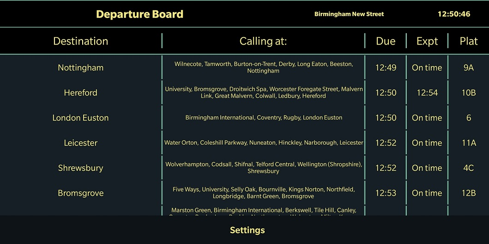

# train-catcher - 

### [Click here to download on Googleplay](https://play.google.com/store/apps/details?id=com.uk.traincatcher)

UK Train station boards. Departure and arrival boards for any train station in the UK.

Train catcher allows you to visualise the departure and arrival boards for any train station in the United Kingdom. It also includes all the calling points between origin and destination. Just select which station you which to see and whether you wish a departure or arrival screen.

*** Use landscape mode for visualising calling points***

On portrait you need to tap on each departure/arrival to visualise the calling points. However, when in landscape mode, you get a bigger screen with much more information.

Tap on the settings button to choose which station you wish to visualise.

Copyright Attributions:

